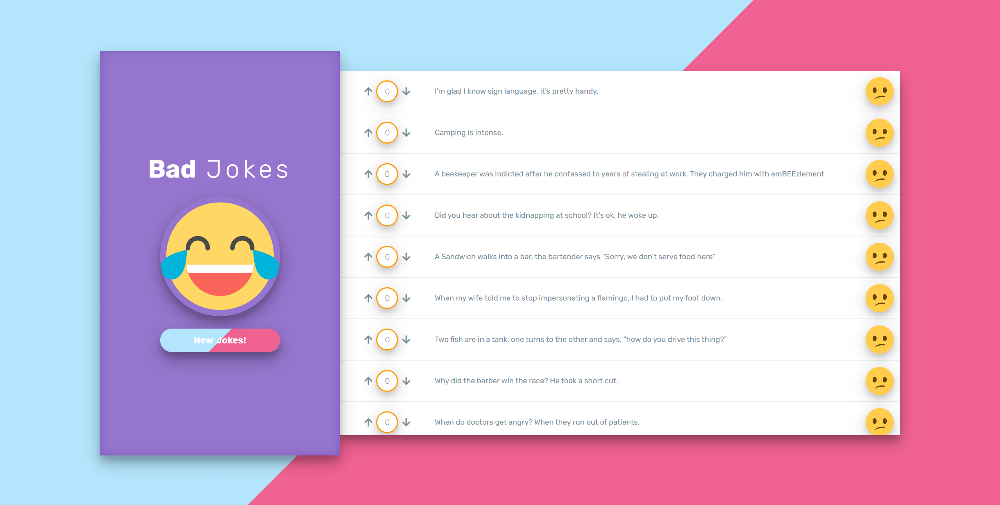

# Bad Jokes - React

A simple React app that fetches jokes from the [icanhazdadjoke.com API](https://icanhazdadjoke.com/) and allows users to upvote or downvote them. Built with React, Framer Motion for animations, and Axios for data fetching.

---

## 🖼️ Preview


---

## ✨ Features
- Fetches dad jokes from a public API.
- Displays jokes with votes.
- Allows users to upvote or downvote jokes.
- Stores jokes and votes in local storage.
- Smooth animations for list updates (using Framer Motion).
- Fully updated to React 18 and Webpack 5 (React Scripts v5).

---

## 🚀 Getting Started

### 1️⃣ Clone the Repository
```bash
git clone https://github.com/mghaithm/Bad-Jokes---React.git
cd Bad-Jokes---React
```

### 2️⃣ Install Dependencies
```bash
npm install
```

### 3️⃣ Run the App
```bash
npm start
```
Open `http://localhost:3000` in your browser.

---

## 📦 Tech Stack
- **React 18**
- **Framer Motion** – for animations.
- **Axios** – for API requests.
- **UUID** – for generating unique IDs.
- **LocalStorage** – to persist data.

---

## 📚 What I Learned
- Deep understanding of React fundamentals, including components, state management, and props.
- Handling asynchronous API requests using `axios` and `async/await`.
- Using `localStorage` to persist data across sessions.
- Smooth list animations with `framer-motion`, and understanding of React 18 compatibility issues.
- Migrating a project from deprecated libraries (like `react-flip-move`) to modern, supported alternatives.
- Managing dependencies and resolving version conflicts during project updates.
- Debugging common issues with Node.js, React, and Webpack.
- Using Git and GitHub for version control and collaboration.
- Writing clean, maintainable code with a focus on user experience.

---
